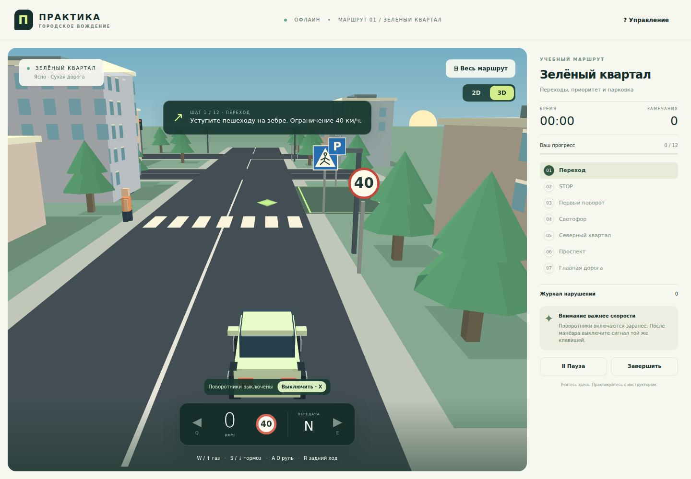

# Версия 0.2 — проверка

Код: cd795041fb7173d25b73c3d0d97848509775784f.

[Chrome и Chromium: проверки пройдены](https://github.com/OlegStrateg/pdd-driving-simulator/actions/runs/35725123597).

29 тестов, ошибок 0. Проверены ZIP с manifest.json в корне, обучение клавишам, переключение 2D/3D, отключение поворотников, полный маршрут, безопасный и неправильный проезд перехода, остановка сцены после ДТП, HTML-отчёт. В Chrome маршрут завершён за 121 секунду; HTTP-запросов и ошибок JavaScript — 0.

[Скриншоты, HTML-отчёт, протокол и ZIP](https://github.com/OlegStrateg/pdd-driving-simulator/actions/runs/35725123597/artifacts/10693012514). Артефакты хранятся 14 дней.

Загрузка расширения проверена через CDP Load unpacked; ручной выбор папки и сохранение PDF не автоматизированы. Время воспроизводится Playwright Clock, позиция автомобиля не подменяется. 3D стилизованная; дорожная модель учебная, полного покрытия ПДД нет.
