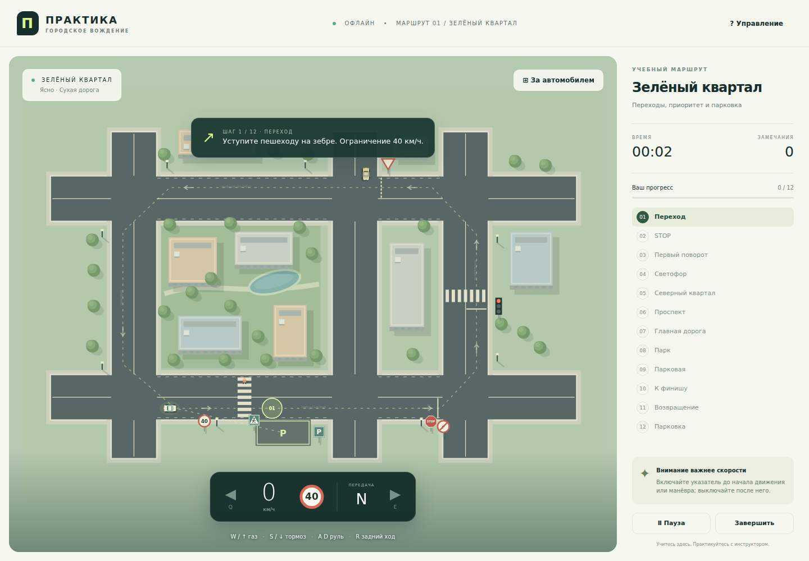

# Проверка первой версии

Дата: 21 сентября 2026.
Проверенный код: [e9ec792e6411b6fe61d326cf2fc4b9460fcb59c0](https://github.com/OlegStrateg/pdd-driving-simulator/commit/e9ec792e6411b6fe61d326cf2fc4b9460fcb59c0).
[GitHub Actions: оба браузера прошли проверку](https://github.com/OlegStrateg/pdd-driving-simulator/actions/runs/35575302989).

## Результаты

| Проверка | Результат |
| --- | --- |
| Unit-тесты правил и физики | 13 / 13, ошибок 0 |
| Упаковка Manifest V3 | PASS; разрешений 0 |
| Google Chrome, unpacked через CDP | PASS |
| Chromium, unpacked через CLI | PASS |
| Открытие из popup расширения | PASS |
| Газ, движение, тормоз, поворотники, пауза и рестарт | PASS |
| Полный маршрут через клавиатурные события | Chrome: 121 с; Chromium: 122 с |
| Нарушения | 3 замечания в маршрутном прогоне; отдельный прогон подтверждает превышение и отсутствие сигнала |
| Выгрузка JSON-протокола | PASS, completed=true, записана траектория |
| Сеть отключена на всём пользовательском пути | PASS, HTTP-запросов 0 |
| Необработанные ошибки JavaScript | 0 |

Браузерный водитель читает координаты из DOM и нажимает обычные клавиши. Он не изменяет позицию, скорость, этапы или нарушения напрямую. Время воспроизводится через Playwright Clock. Это реальная отрисовка приложения и обработка событий, а не мок экрана.

**Ограничение проверки:** установка в Google Chrome выполнена через browser-scoped DevTools `Extensions.loadUnpacked`. Ручной выбор папки в системном диалоге `chrome://extensions` не проверялся. Автоматический водитель завершил маршрут с замечаниями, не «сдал официальный экзамен».

## Доказательства и загрузка

- [Chrome: ZIP расширения, четыре PNG пользовательского пути, обзор города, JSON-протокол и итог проверки](https://github.com/OlegStrateg/pdd-driving-simulator/actions/runs/35575302989/artifacts/10627651080).
- [Chromium: тот же комплект доказательств](https://github.com/OlegStrateg/pdd-driving-simulator/actions/runs/35575302989/artifacts/10627731520).
- Артефакты Actions хранятся 14 дней. Постоянный скриншот ниже сохранён в git.
- Для установки без Actions скачайте ZIP рабочей ветки и загрузите папку `extension`: [инструкция](../README.md#запуск-в-chrome).

## Границы первой версии

Один учебный квартал, оригинальная 2D-графика, ограниченное число участников движения. Правила реализованы для заданных ситуаций; полного покрытия ПДД, официальной экзаменационной оценки, повреждений автомобиля и реалистичной 3D-физики нет.
